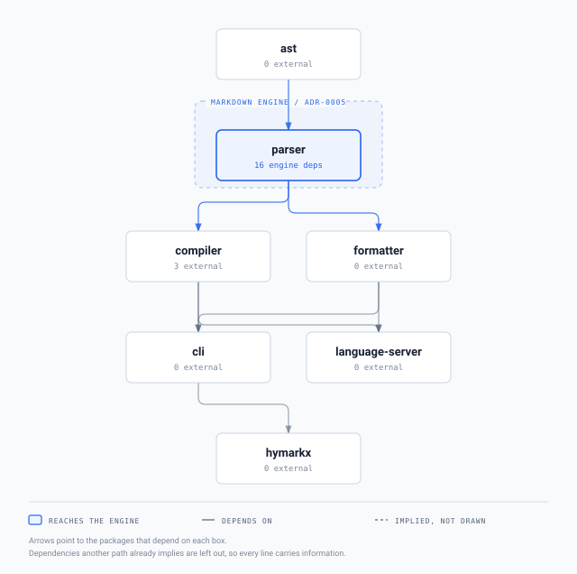

<p align="center">
  
</p>

# HyMarkX

**Markdown that grows into a web app — and stops growing when you stop asking.**

[](https://www.npmjs.com/package/hymarkx)
[](https://github.com/NAME0x0/HyMarkX/actions/workflows/ci.yml)
[](tests/conformance/)
[](tests/conformance/)
[](docs/guides/interactivity.md)
[](LICENSE-MIT)

`HyMarkX` (**HMX**, extension `.hmx`, CLI `hmx`) is a Markdown-compatible,
progressively enhanced language for documents, websites, interfaces, and interactive
web applications.

```sh
npm install -g hymarkx
hmx build page.hmx
```

> ⚠️ **Status: alpha (0.0.9).** Published and installable, but syntax may still change
> without migration paths, and HyMarkX **must not be used to render untrusted content in
> production** — see [`SECURITY.md`](SECURITY.md) and the
> [security audit](docs/security-audit.md) for exactly why.

<p align="center">
  
</p>

*Every frame above is generated from real compiler output by
[`scripts/generate-evolution-svg.mjs`](scripts/generate-evolution-svg.mjs) — the source, the
rendered preview, the colours, and the byte counts. A test asserts the numbers still match
what the compiler emits, so the picture cannot drift into marketing.*

## Why

Markdown is the best way to write content and the worst way to build an interface. The
moment you need layout, reuse, or interactivity, you fall off a cliff into HTML, CSS,
JSX, TypeScript, a component library, and a bundler — all at once, before you needed
any of it.

HMX tries to remove the cliff rather than narrow it:

```
Plain text → Markdown → styled document → components → interactivity → application
```

You pay for a capability when you use it — in syntax, in learning, in runtime bytes.

## What it looks like

Ordinary Markdown is already HMX:

```md
# Hello World

This is my website.

## Projects
- AVA
- HyMarkX
```

Components are directives, not JSX. Containers nest by matching, so depth costs nothing
(ADR-0021):

```md
:::grid{columns=3 gap=4}

:::card
## Revenue
$42,500
:::

:::card
## Users
14,302
:::

:::
```

Not this:

```tsx
<div className="grid grid-cols-3 gap-4">
  <Card><CardHeader><CardTitle>Revenue</CardTitle></CardHeader>
    <CardContent>$42,500</CardContent></Card>
</div>
```

Values come from frontmatter and resolve at compile time — a page using them still ships
zero JavaScript:

```md
---
title: Analytics
---

# {{ title }}
```

Reusable components are `.hmx` files declaring their props:

```md
---
props:
  title: { type: string, required: true }
---

:::note
## {{ title }}

::children
:::
```

Interactivity is native, and compiles to a **591-byte gzipped** runtime:

```md
::state{count=0}

:::button{on-click="count = count + 1"}
Increment
:::

Count is {{ count }}.
```

## Design commitments

| | |
|---|---|
| **Markdown first** | A plain `.md` file is a valid HMX document. Enforced by CommonMark + GFM conformance suites in CI — 652/652, unchanged across seven syntax additions. |
| **Pay for what you use** | A static document compiles to HTML + CSS and **zero** JavaScript. CSS is emitted only for components actually used. Byte budgets are tests. |
| **Safe by default** | Rendering an untrusted document does not run code — *including interactive ones*. Expressions are a restricted pure sub-language with no host access, so `window`, `fetch`, and `document` are compile errors, not sandboxed calls. |
| **Framework neutral** | React may get a good adapter. The language is not defined by it. |
| **Not MDX with more syntax** | If a feature makes native HMX approach the verbosity of a conventional frontend, the feature is wrong. |

HMX claims **no novelty** in combining Markdown with components — MDX, Markdoc, Astro,
Quarto and others got there first. See [`docs/research/prior-art.md`](docs/research/prior-art.md)
for an honest account of what each does better and what HMX is actually claiming.

## Try it

```sh
npm install -g hymarkx

hmx build page.hmx            # a complete HTML document, plus CSS and JS if used
hmx build page.hmx --fragment # just the fragment, to embed in an existing page
hmx build page.hmx --out -    # compile to stdout, assets inlined
hmx check page.hmx            # diagnostics only
hmx fmt page.hmx --check      # formatting, CI mode
hmx dev .                     # dev server with live reload
```

### Packages

| Package | Purpose |
|---|---|
| [`hymarkx`](https://www.npmjs.com/package/hymarkx) | Install this — provides the `hmx` command |
| [`@hymarkx/compiler`](https://www.npmjs.com/package/@hymarkx/compiler) | Documents to HTML, CSS, and an optional runtime |
| [`@hymarkx/parser`](https://www.npmjs.com/package/@hymarkx/parser) | Markdown + HMX to an AST with real source spans |
| [`@hymarkx/ast`](https://www.npmjs.com/package/@hymarkx/ast) | Node types, spans, diagnostics |
| [`@hymarkx/formatter`](https://www.npmjs.com/package/@hymarkx/formatter) | `hmx fmt` |
| [`@hymarkx/language-server`](https://www.npmjs.com/package/@hymarkx/language-server) | LSP for editors |
| [`@hymarkx/cli`](https://www.npmjs.com/package/@hymarkx/cli) | CLI implementation |

### From source

```sh
pnpm install && pnpm build && pnpm check
```

## Repository layout

```
packages/ast              node types, spans, visitors, diagnostics
packages/parser           source → HMX AST (the only package that may touch micromark/mdast)
packages/compiler         analysis, components, styles, expressions, HTML backend, runtime
packages/formatter        canonical formatting of HMX constructs
packages/language-server  LSP: diagnostics, completion, hover, formatting
packages/cli              the `hmx` binary
editors/vscode            language contribution, TextMate grammar, LSP client
prototypes/               throwaway experiments kept as evidence
```

Packages are created when a boundary is real, not to match a diagram.

## Documentation

| Document | What it is |
|---|---|
| [`VISION.md`](VISION.md) | Why the project exists and what would make it fail |
| [`SPEC.md`](SPEC.md) | Normative language specification (v0.0 draft) |
| [`ARCHITECTURE.md`](ARCHITECTURE.md) | Pipeline, packages, diagnostics, testing |
| [`SECURITY.md`](SECURITY.md) | Trust modes, threat model, and vulnerabilities found |
| [`docs/security-audit.md`](docs/security-audit.md) | Every threat walked, with the test behind each control — and the two with no test |
| [`docs/research/performance.md`](docs/research/performance.md) | Measured baseline: plain CommonMark costs what a bare CommonMark parse costs |
| [`ROADMAP.md`](ROADMAP.md) | Phases, exit criteria, and the Markdoc gate |
| [`BACKLOG.md`](BACKLOG.md) | Prioritised work, and rejected ideas with reasons |
| [`docs/adr/`](docs/adr/) | 21 Architecture Decision Records |
| [`docs/guides/`](docs/guides/) | Data and expressions, styling, components, interactivity, formatting, dev server, editors |
| [`CONTRIBUTING.md`](CONTRIBUTING.md) | Workflow, change control, definition of done |
| [`llms.txt`](llms.txt) | Canonical summary for language models, including the mistakes they actually make |
| [`AGENTS.md`](AGENTS.md) | Instructions for coding agents working on this repository |

### Using HMX with an AI assistant

Point it at [`llms.txt`](llms.txt). It documents the syntax, the built-in components, the
trust model — and, most usefully, what **does not** exist, so a model does not invent
`@state` or `` from other languages it has seen.

Editor-specific entry points are included: a Claude Code skill at
`.claude/skills/hymarkx/`, Cursor rules at `.cursor/rules/`, and `AGENTS.md` for Codex.
All three defer to `llms.txt` rather than restating it, and every example in them is
compiled by the test suite.

## Status

**Phases 0–9 complete; published to npm as 0.0.9.** 1,524 tests. CommonMark 652/652 and
GFM 40/40, never regressed across ten phases and eight syntax additions.

| Phase | |
|---|---|
| 0 Research and charter | ✅ |
| 1 Markdown foundation | ✅ |
| 2 Directives, schemas, frontmatter | ✅ |
| 3 Styling | ✅ |
| — *"is this just Markdoc?" gate* | ✅ passed on measured evidence |
| 4 Expressions | ✅ |
| 5 Authored components | ✅ |
| 6 State, events, runtime | ✅ |
| 7 Developer experience | ✅ |
| 8 TS/TSX interoperability | ✅ |
| 9 Hardening, fuzzing, audit, publish | ✅ |
| 10 Ecosystem | not started |

Phase 9 found two real defects that no existing suite would have caught, both now fixed and
regression-tested: a parser hang reachable from untrusted input, found by
[fuzzing](SECURITY.md#vulnerabilities-found-and-fixed) on its first run, and a silent
code-span corruption in ordinary prose, found by compiling every Markdown file in this
repository against a reference renderer. Both are written up rather than quietly patched,
because the pattern is more useful than the individual bug.

The gate at the end of Phase 3 was a genuine stop condition: without a demonstrated path to
native interactivity, HMX would have been Markdoc with different punctuation and should not
have continued. It passed on a working prototype — 492 bytes gzipped against React's 47,750
for the same counter — not on an argument. See [`ROADMAP.md`](ROADMAP.md).

**What is deliberately not built yet:** named derived state, shared state between siblings,
async or data loading, named slots, TSX interop, and author CSS in `document` mode. Each is
recorded with its reasoning rather than left as an implied promise.

## Architecture at a glance

<p align="center">
  
</p>

Generated from the package manifests by
[`scripts/generate-dependency-graph.mjs`](scripts/generate-dependency-graph.mjs), with a test
that regenerates it and compares bytes — adding a dependency without redrawing fails the build.
Edges another path already implies are left out, so every line drawn carries information.

The purple box is the point: **only `@hymarkx/parser` may import micromark, mdast, or any other
Markdown engine.** That is ADR-0005, and `scripts/check-boundaries.mjs` enforces it on every
run, including for editor integrations and benchmarks. Everything downstream speaks the HMX AST
and nothing else, which is what keeps the compiler swappable and the browser-facing packages
free of Node.

## License

Licensed under either of [MIT](LICENSE-MIT) or [Apache License 2.0](LICENSE-APACHE), at
your option. Rationale in [ADR-0010](docs/adr/0010-licensing.md).

**Your content stays yours.** Compiler output — and the HMX runtime embedded in that
output — imposes no licensing obligation on the documents, sites, or applications you
build with HyMarkX.

The **name** is handled separately: `HyMarkX`, `HMX`, `.hmx`, `hmx`, and `@hymarkx` are
project marks, so that `.hmx` keeps meaning one thing. Forks are welcome under the code
license; see [`TRADEMARK.md`](TRADEMARK.md) for naming them.

Unless you state otherwise, any contribution you intentionally submit for inclusion is
dual licensed as above, with no additional terms.
